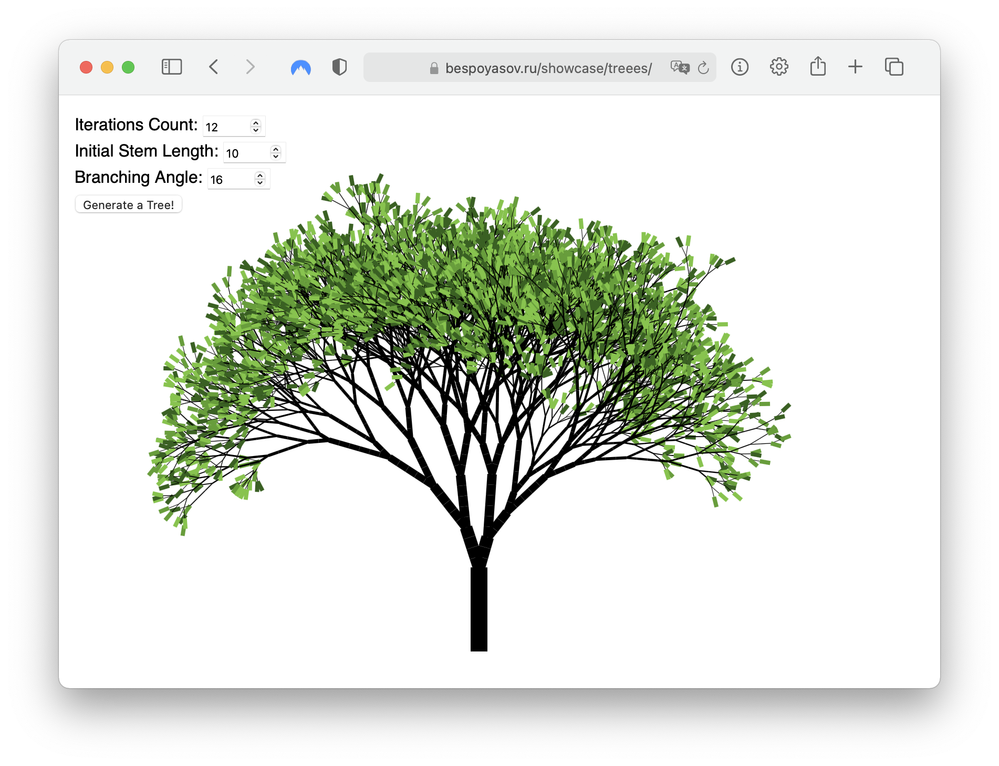

# treees

Trees images [generator](https://bespoyasov.ru/showcase/treees/) made with TypeScript using OOP principles.

The blog post about it:

- [🇷🇺 Рисуем деревья на Canvas с помощью L-систем, TypeScript и ООП](https://bespoyasov.ru/blog/generating-trees-on-canvas-using-typescript-and-oop)

## Credits

Made with [createapp.dev](https://createapp.dev/). Uses [wessberg/DI](https://github.com/wessberg/di) and [wessberg/DI-compiler](https://github.com/wessberg/DI-compiler) as a DI container.
